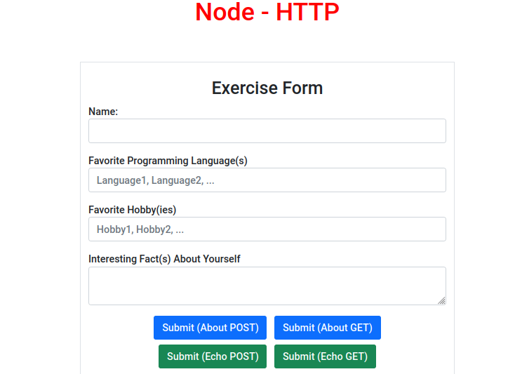
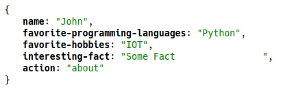

# Node.js HTTP Exercise

### Entry Page

### Results Page

## Getting Started

1. Open your command line and navigate to your repos directory (if you do not have a repos folder, then you can use mkdir repos to create one)
2. Use this template repository to start a new project in your repos folder: git clone <repo_name>
3. cd repo_name to navigate into your new repo directory
4. Start Visual Studio Code and select 'Open Folder'. Then select repo_name to open the folder in the editor (or just type code . in your terminal inside the repo directory)
5. Follow the instructions on the README.md file to complete exercises
6. Open the app.js file to get started

## Exercise

### Additional Features

In this exercise additional features have been added to provide for easier testing.
An HTML form is used when responding the `localhost:3000/` path that prompts the user
to enter name, favorite programming languages, favorite hobbies and an interesting fact
about themselves. Four submit buttons are provided to submit a POST or GET for either of 
the path's `localhost:3000/about` or `localhost:3000/echo`. The reponse will be in
`appication/json` for both path's. In addition POSTMAN may be used for testing (A JSON file 
is provided for testing `node_http.postman_collection.json`). At minimum
the following keys must be used in the body or as parameters in the url string when using 
postman.

- name
- favorite-programinng-languages
- favorite-hobbies
- interesting-fact

Webpack is being used to make a distributable. To build the project run the following:

- `npm install`
- `npm run build:dev`
- `npm start`

If running the ditributable directly run the following:

- `npm install`
- unzip the dist.zip file in the dist directory using the following:
  - `unzip -d NEW-DIRECTORY`
  - Navigate to the new directory and run:
    - `npm install`
    - Once complete run (to start server):
      - `node main.js` 

### Objective

- Create a server that responds to requests
- The server should have at least ‘/echo’, ‘/’, and ‘/about’ endpoints
- The server will account for ‘not found’ endpoints
- The ‘/echo’ endpoint will use the ReadStream response object to read the request body, and return the request body as the response body to the client
- The ‘/’ endpoint will respond as you wish
- The ‘/about’ endpoint will return a JSON response with information about yourself

### Steps

- Start in your `app.js` file
- Import the http module
- Using the http module, call the createServer
- Pass in a request handler callback function to the createServer method that receives request and response objects as parameters
- Add an event listener to the request object that listens for the ‘data’ event to be emitted from the ReadStream
- Store the chunks in an array
- Add an event listener to the request object that listens for the ‘end’ event to be emitted from the ReadStream
- Set a new variable ‘body’ equal to Buffer.concat(array).toString()
- Write a conditional statement that assesses the request url, and responds appropriately:
  - ‘/’ - Wildcard. Respond with whatever information you wish
  - ‘/about’ - Respond with an object that has information about yourself
  - ‘/echo’ - Respond with an object that, a minimum, includes the request method, url and body.
- Make sure to end your response with .end()
- Set your server to listen on port 3000
- Initiate the file using the node.js CLI
